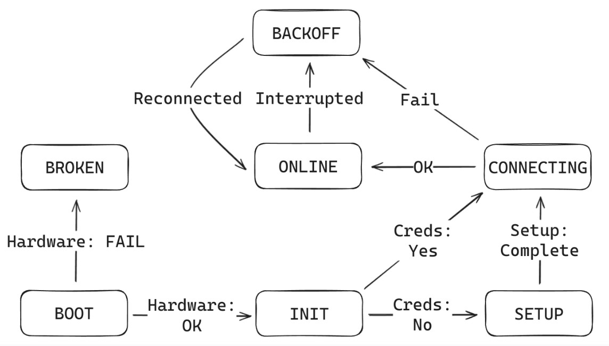
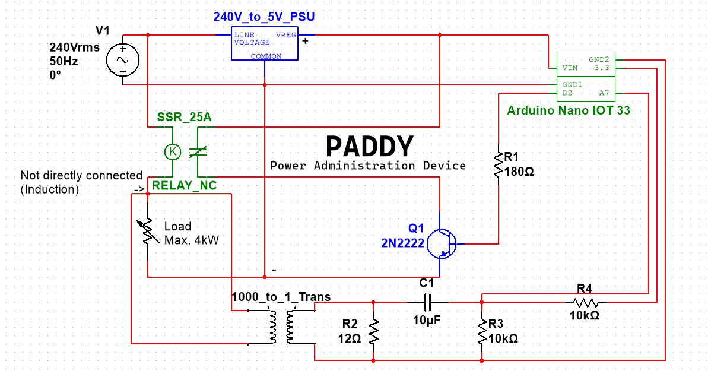

    

# Paddy Firmware

This is the firmware component for Paddy, the Power Administration Daemon.

It uses Arduino C++, and is designed around a state machine. It is flashed directly on a supported chip. The Arduino type used for this project is an IoT Nano 33.

The job of this code is to interface with the Paddy MQTT Broker through Wi-Fi, or the Paddy App through Bluetooth Low Energy, for setup & error handling. The code should also control the hardware that performs:

1. On/Off toggling of the load device
2. Power measurement for the load device, with periodic statistic sending.

# State Machine Diagram

    

# Overview
The code of this state machine is organized with singleton components which are instantiated once in the firmware and reused throughout the program’s lifecycle. These modules are as following:
* **BLE:** Handles direct communication between the Daemon and the Central device.
* **Control:** Turns the load device ON or OFF depending on the command received at the time.
* **MQTT:** Handles all communication with the broker, and delegates work to other components or states on message retrieval.
* **Power:** Controls & calibrates the power measurement Current Transformer. Makes periodic readings.
* **Storage:** Emulates an EEPROM chip due to the chosen Arduino IoT Nano 33 not having an actual EEPROM. Stores necessary credentials on it.
* **Wi-Fi:** Handles Wi-Fi connections & signal strength measurement.

With each state having a predefined duty, it is easy to understand what each piece of the flow does:

* **Boot State:** This is the initial state that the microcontroller goes into as soon as it boots up. Hardware checks are performed here, specifically the Wi-Fi module and the Bluetooth Low Energy module. If these checks are successful and the Daemon can initialize the aforementioned components, then it moves onto the Init state. Otherwise, it moves onto Broken, stopping there and flashing an LED indicating a hardware error to the user.
* **Init State:** The Init state is the first intermediate state that the Daemon enters. Its purpose is to prepare the device for proper function, by firstly calibrating the power measurement module by cycling it a few times, accustoming the device readings to the line current. Afterwards, it is verified whether the Daemon contains any credentials stored in its Emulated EEPROM or not. The Daemon moves onto the Connecting state with said credentials if the former is true, otherwise the Setup phase is entered.
* **Setup State:** With its blocking behavior, this state won’t progress until user action is done. Since the Daemon does not contain any credentials here, it has no idea how to connect to the Wi-Fi or broker. This means that at this stage, the Daemon is unable to use Wi-Fi for data transfers, and needs a direct approach. BLE is perfect for this scenario, as writing and reading through characteristics is easily achievable from the Paddy App. Hence, the BLE capabilities of the device are used to emit these characteristics:
> * _Serial (read-only):_ A characteristic which emits the serial number of the device.
> * _SSID (write-only):_ The Service Set Identifier for the Wi-Fi network.
> * _Password (write-only):_ The password of the Wi-Fi access point.
> * _Enterprise Username (write-only):_ If the Wi-Fi requires enterprise authentication techniques such as EAP or PEAP, the username for the user.
> * _Enterprise Password (write-only):_ If the Wi-Fi requires enterprise authentication techniques such as EAP or PEAP, the password for the user.
> * _JWT (write-only):_ The JSON Web Token used by the Daemon to connect to the broker.
> * _Reset (write-only):_ When this characteristic is written to, the Daemon resets its credentials.

To proceed, the JWT and credential characteristics must be written to by the mobile device of the user through the Paddy App. It must be noted that for simplicity, the firmware detects this stage as completed only writing to the SSID characteristics. As such, writes can happen in any order except for the SSID one, which must be written to last for predictable behavior to be achieved. To discern between authorization modes, different combinations of written characteristics yield three configurations when it comes to Wi-Fi authorization: _Insecure_ (SSID Only), _Secure_ (SSID + Password) and _Enterprise_ (SSID + Enterprise Username + Enterprise Password).

* **Connecting State:** This state is relatively simple, as it only runs while the Daemon is connecting to the backend broker. On connection success it hands over the state to the Online one, and to Backoff on failure.
* **Online State:** The “working” state of the Daemon, this represents a fully functional PAD. Here it can interact with the broker by receiving MQTT messages, and sending them. The Daemon has a few duties while it is in this state:
> * Listen for MQTT messages, namely on the on, off, reset and rotate topics. When one of these messages is received, it appropriately performs the right action.
> * Send keep-alive ping messages to the broker. These messages are purely for statistical purposes and are unnecessary to actually keep the connection alive; they are merely used to keep track of the Daemon’s status from the app. In the payload of these messages, the Wi-Fi signal strength is relayed.
> * Periodically relay power usage data to the broker.
> * Check if the device is still connected to the broker. If the device is no longer connected, go to Backoff.
* **Backoff State:** While this state serves as a padding before the Daemon retries connections, it also is a window for the user to reset the Daemon through a direct BLE connection. For instance, in cases where the Daemon is moved from a place with another Wi-Fi connection, it already has credentials, but they are incorrect. As such, when the Daemon reaches the backoff state, it opens up a 60-second window in which the user can reset it through BLE directly. However, if the 60-second counter runs out, the Daemon will retry to connect to the server again by moving to the Connecting state.

# Circuit Diagram

    

